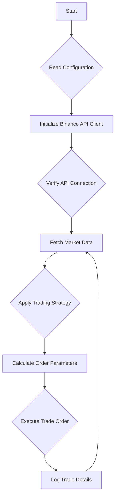

# Binance Trading Bot

A fully automated cryptocurrency trading bot built using the Binance API, designed to execute trades programmatically based on defined strategies. This project provides a clean, modular structure with dedicated components for configuration, client handling, trading logic, and debugging, making it an ideal starting point for developing your own automated trading solutions.

The bot supports interaction with Binance’s spot trading system and allows for easy extension and implementation of custom trading strategies.

## Key Features

-   **Automated Trading**: Executes trades on Binance automatically using predefined logic in `bot.py`.
-   **Modular Architecture**: Cleanly separated files for client management, core bot logic, configuration, debugging, and trade execution.
-   **Configuration Management**: Easily manage API keys, trade settings, and environment details in a centralized `config.py` file.
-   **Real-time API Interaction**: Utilizes the official Binance API to fetch live market data and place orders in real-time.
-   **Debugging Tools**: Includes a `debug_connect.py` script to verify the API connection and permissions before deploying the bot.
-   **Easily Extensible**: Designed to be easily extended with custom strategies inside the `src/` directory.

## Workflow Diagram

The diagram below illustrates the operational flow of the Binance Trade Bot, from initialization to trade execution.


## Project Structure

The project is organized into a clean and understandable structure to facilitate development and maintenance.

| File / Directory      | Description                                                 |
| --------------------- | ----------------------------------------------------------- |
| `app.py`              | Main entry point of the application.                        |
| `bot.py`              | Contains the core trading logic and strategy implementation.|
| `client.py`           | A wrapper for the Binance API client.                       |
| `config.py`           | Stores API keys, trade settings, and other configurations.  |
| `debug_connect.py`    | Utility script for testing the Binance API connection.      |
| `requirements`        | A list of required Python dependencies for the project.     |
| `LICENSE`             | The MIT License file for the project.                       |
| `Readme.md`           | The project's README file.                                  |
| `src/`                | A directory for additional modules or custom strategies.    |

## Prerequisites
Before you begin, ensure you have the following installed on your system:
- [Python 3.9+](https://www.python.org/downloads/)
- [Git](https://git-scm.com/downloads/)
- A Binance account with API keys generated.

## Installation Guide

Follow these steps to set up the Binance Trade Bot on your local machine.

### 1. Clone the Repository

First, clone the repository to your local machine using Git:

```bash
https://github.com/medhinibr/Binance-Trade-Bot
cd Binance-Trade-Bot
```

### 2. Create a Virtual Environment

It is highly recommended to use a virtual environment to manage the project's dependencies.

**On Linux / macOS:**

```bash
python -m venv venv
source venv/bin/activate
```

**On Windows:**

```bash
python -m venv venv
venv\Scripts\activate
```

### 3. Install Dependencies

Install all the required Python libraries using pip and the `requirements` file:

```bash
pip install -r requirements
```

## Configuration

Before running the bot, you need to configure your Binance API keys and trading parameters. Edit the `config.py` file with your specific details.

| Variable       | Description                                                 |
| -------------- | ----------------------------------------------------------- |
| `API_KEY`      |  Your Binance API key.                                      |
| `SECRET_KEY`   | Your Binance secret key.                                    |
| `TRADE_SYMBOL` | The trading pair you want the bot to trade (e.g., "BTCUSDT").|
| `TRADE_AMOUNT` | The amount of the asset to trade in each transaction.       |
| `TEST_MODE`    | Set to `True` for paper trading, `False` for live trading.  |

## Running the Bot

Once the installation and configuration are complete, you can run the bot.

### Check Binance Connection
Before starting the bot, it is a good practice to test the API connection to ensure your keys are valid and have the correct permissions.
```bash
python debug_connect.py
```

### Start Trading
To start the main application and begin trading, run the `app.py` script.

```bash
python app.py
```

Alternatively, you can run the core bot logic directly:

```bash
python bot.py
```

## Important Notes

-   **API Key Security**: Never commit your `API_KEY` and `SECRET_KEY` to a public repository. Keep them secure and confidential.
-   **Test Mode**: Always use `TEST_MODE = True` to test your strategies and configurations without risking real funds.
-   **Disclaimer**: This project is intended for educational purposes only. Cryptocurrency trading involves a high level of risk, and you should be fully aware of the potential for losses.

## Future Enhancements

This project can be extended with additional features to create a more robust trading bot. Some potential enhancements include:
-   **Multiple Trading Strategies**: Implement a variety of trading strategies that can be selected through the configuration.
-   **Risk Management**: Integrate stop-loss and take-profit mechanisms to manage risk effectively.
-   **Notifications**: Add alerts via Telegram, Discord, or email to stay informed about the bot's activity.
-   **GUI Dashboard**: Develop a graphical user interface to monitor the bot's performance and manage settings.
-   **Backtesting Module**: Create a backtesting module to test trading strategies against historical market data.

## Contributing
Contributions are welcome! If you would like to contribute to this project, please follow these steps:

1.  Fork the repository.
2.  Create a new branch (`git checkout -b feature/your-feature-name`).
3.  Make your changes and commit them (`git commit -m 'Add some feature'`).
4.  Push to the branch (`git push origin feature/your-feature-name`).
5.  Open a Pull Request.

## License
This project is released under the MIT License. See the [LICENSE](LICENSE) file for more details.


