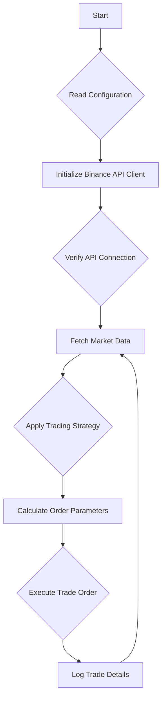

# Binance Trading Bot

A fully automated cryptocurrency trading bot built using the Binance API, designed to execute trades programmatically based on defined strategies. This project provides a clean, modular structure with dedicated components for configuration, client handling, trading logic, and debugging, making it an ideal starting point for developing your own automated trading solutions.

The bot supports interaction with Binance’s spot trading system and allows for easy extension and implementation of custom trading strategies.

## Key Features

-   **Automated Trading**: Executes trades on Binance automatically using predefined logic in `bot.py`.
-   **Modular Architecture**: Cleanly separated files for client management, core bot logic, configuration, debugging, and trade execution.
-   **Configuration Management**: Easily manage API keys, trade settings, and environment details in a centralized `config.py` file.
-   **Real-time API Interaction**: Utilizes the official Binance API to fetch live market data and place orders in real-time.
-   **Debugging Tools**: Includes a `debug_connect.py` script to verify the API connection and permissions before deploying the bot.
-   **Easily Extensible**: Designed to be easily extended with custom strategies inside the `src/` directory.

## Workflow Diagram

The diagram below illustrates the operational flow of the Binance Trade Bot, from initialization to trade execution.

## Project Structure

The project is organized into a clean and understandable structure to facilitate development and maintenance.

| File / Directory      | Description                                                 |
| --------------------- | ----------------------------------------------------------- |
| `app.py`              | Main entry point of the application.                        |
| `bot.py`              | Contains the core trading logic and strategy implementation.|
| `client.py`           | A wrapper for the Binance API client.                       |
| `config.py`           | Stores API keys, trade settings, and other configurations.  |
| `debug_connect.py`    | Utility script for testing the Binance API connection.      |
| `requirements`        | A list of required Python dependencies for the project.     |
| `LICENSE`             | The MIT License file for the project.                       |
| `Readme.md`           | The project's README file.                                  |
| `src/`                | A directory for additional modules or custom strategies.    |

## Installation Guide

Follow these steps to set up the Binance Trade Bot on your local machine.

### 1. Clone the Repository

